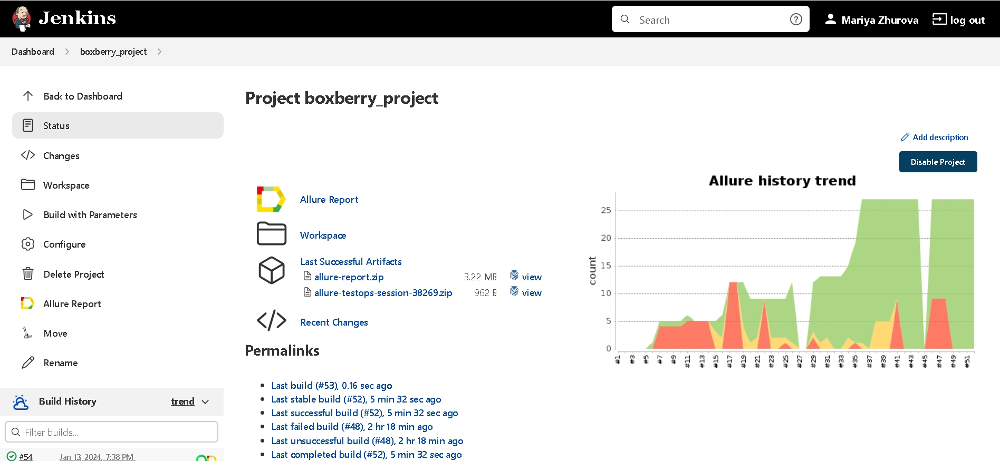
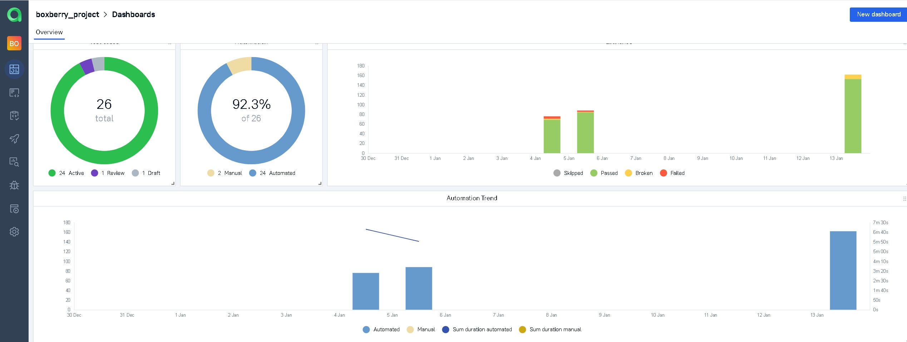
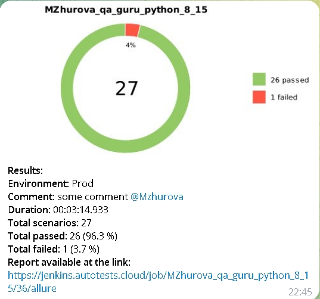

<h1> Проект по тестированию логистического веб-сервиса <a target="_blank" href="https://boxberry.ru/">"Boxberry"</a> </h1>


----
## *UI-тесты*
### Список проверок, реализованных для главной страницы
#### Auto Tests
- [x] *Установка города. Проверка, что установился выбранный город*
- [x] *Редирект на страницу логина для интернет-магазинов из списка по кнопке "Личный кабинет"*
- [x] *Переход на странцу восстановления пароля*
- [x] *Поиск посылки по трек-номеру. Проверка, открытия страницы с информацией по отслеживаемой посылке*
### Список проверок, реализованных для страницы "Отправить посылку"
#### Auto Tests
- [x] *Переход к калькулятору расчета посылок для частных клиентов по кнопке "Рассчитать"*
- [x] *Расчет стоимости доставки, в зависимости от маршрута, габаритов послыки и выбранной упаковки*
- [x] *Открытие страницы с информацией "Как получить посылку" по кнопке*
### Список проверок, реализованных для страницы "Бизнесу"
#### Auto Tests
- [x] *Переход к калькулятору расчета посылок для интернет-магазинов по кнопке "Рассчитать"*
- [x] *Расчет стоимости доставки, в зависимости от маршрута и габаритов послыки*
- [x] *Переход к калькулятору расчета посылок для интернет-магазинов по кнопке "Показать отделения"*
- [x] *Поиск отделений в указанном городе*
- [x] *Корректность сообщения о ненахождении заказа, при поиске по несуществующему трек-номеру*
#### Manual Tests
- [x] *Поиск отделений, где доступен "Экспресс-прием"*
- [x] *Поиск отделений, где доступен "Прием на терминале"*

## *API-тесты*
### Список проверок, реализованных для методов
- [x] *Получение успешных статус кодов и валидация ответов по схемам*
- [x] *Полное сравнение ответа с эталонным файлами*
- [x] *Запросы с несколькими параметрами*
- [x] *Параметризованные тесты с несколькими аргументами*
- [x] *Получение пустого массива*
- [x] *Получение ошибки при неверном запросе*
- [x] *Проверка полученных массивов на длину*


----
### Проект реализован с использованием:
<p  align="center">
    <code></code>
    <code></code> 
    <code></code> 
    <code></code>
    <code></code>
    <code></code>
    <code></code>
    <code></code>
    <code></code>
    <code></code>
    <code></code>
    <code></code>
    <code></code>
</p>

----

### Локальный запуск автотестов

#### Выполнить в cmd:

```bash
python -m venv .venv
source .venv/bin/activate
pip install -r requirements.txt
pytest tests
```

#### Получение отчёта:
```bash
allure serve build/allure-results
```

----


### Проект в Jenkins
> <a target="_blank" href="https://jenkins.autotests.cloud/job/boxberry_project/">Ссылка на проект</a>

#### Запуск автотестов в Jenkins
1. Открыть <a target="_blank" href="https://jenkins.autotests.cloud/job/boxberry_project/">проект</a>



2. Выбрать пункт `Build with Parameters`
3. Выбрать окружение в выпадающем списке ENVIRONMENT


4. Указать комментарий в поле COMMENT
5. Нажать кнопку `Build`

----

### Allure отчет
#### Общие результаты 


#### Результаты прохождения теста


#### Графики


----

### Интеграция с Allure TestOps
> <a target="_blank" href="https://allure.autotests.cloud/project/3862/dashboards">Ссылка на проект</a>

#### Дашборд с общими показателями тестовых прогонов



#### История запуска тестовых наборов


#### Manual и Auto тест-кейсы


----

### Интеграция с Jira
> <a target="_blank" href="https://jira.autotests.cloud/browse/HOMEWORK-992">Ссылка на проект</a>


----

### Оповещения в Telegram


----

### Видео прохождения автотеста

#### Рассчет стоимости доставки послыки для частных клипентов 


----
